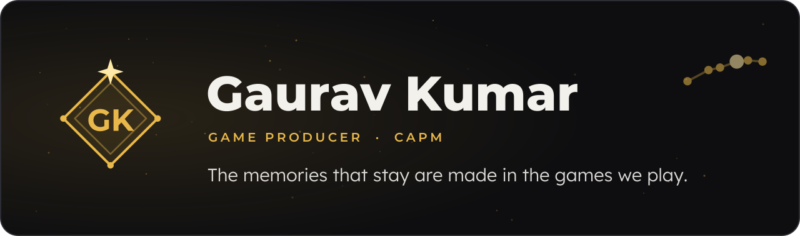
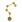

  

Games gave me my best memories, played side by side with family and friends. I want to spend my career giving players memories like that, anywhere in the world.

I am a game producer who knows the craft from the inside. I have built games, tested live ones and led teams to ship them: I own the plan, lead the people and get the game into players' hands.

I am up for any challenge where the player's experience comes first. If your team is building games people will remember, I would love to help make them.

### How I work

&nbsp; **Listen first, then lead.** I talk with every team before I plan, so the plan works for the people doing the work.

&nbsp; **Fix the root, and the branches follow.** I trace a problem to where it starts and fix it there, once.

&nbsp; **Say it early, say it clearly.** Nobody on my team is surprised, and nobody is left guessing.

&nbsp; **I know the work because I do the work.** I build in Unity myself, so every plan respects the craft.

Unity &nbsp;·&nbsp; C# &nbsp;·&nbsp; Photon &nbsp;·&nbsp; Jira &nbsp;·&nbsp; Azure DevOps &nbsp;·&nbsp; Photoshop &nbsp;·&nbsp; Illustrator &nbsp;·&nbsp; Agile &nbsp;·&nbsp; CAPM (PMI)

### Games I have made

&nbsp; **[Planet of Twins](https://gauravk908567.github.io/landing1.html?utm_source=github&utm_medium=profile)**. A co-op action-adventure for PC where two twins share one life. I produce it and I build it.

&nbsp; **[Action RPG](https://gauravk908567.github.io/landing5.html?utm_source=github&utm_medium=profile)**. Built by a team of three. I ran the team, set the look and built the world.

&nbsp; **[FPP Horror](https://gauravk908567.github.io/landing.html?utm_source=github&utm_medium=profile)**. A first-person survival horror game, built solo from start to finish.

&nbsp; **[Furry Escape](https://gauravk908567.github.io/landing4.html?utm_source=github&utm_medium=profile)**. My first published game, playable in the browser. [Code](https://github.com/gauravk908567/HyperCasual)

&nbsp; **[Space Shooting Range](https://gauravk908567.github.io/landing3.html?utm_source=github&utm_medium=profile)**. A 2D shooter in the spirit of the NES games I grew up on. [Code](https://github.com/gauravk908567/SpaceShooter)

&nbsp; **[FPS Multiplayer](https://gauravk908567.github.io/landing2.html?utm_source=github&utm_medium=profile)**. A multiplayer prototype built to learn real-time networking with Photon.

### Find me

**[Portfolio](https://gauravk908567.github.io/?utm_source=github&utm_medium=profile)** &nbsp;·&nbsp; **[LinkedIn](https://www.linkedin.com/in/gaurav-kumar-20492818b/)** &nbsp;·&nbsp; **[Email](mailto:gauravk908567@gmail.com)**

Everything new goes on my portfolio first.
